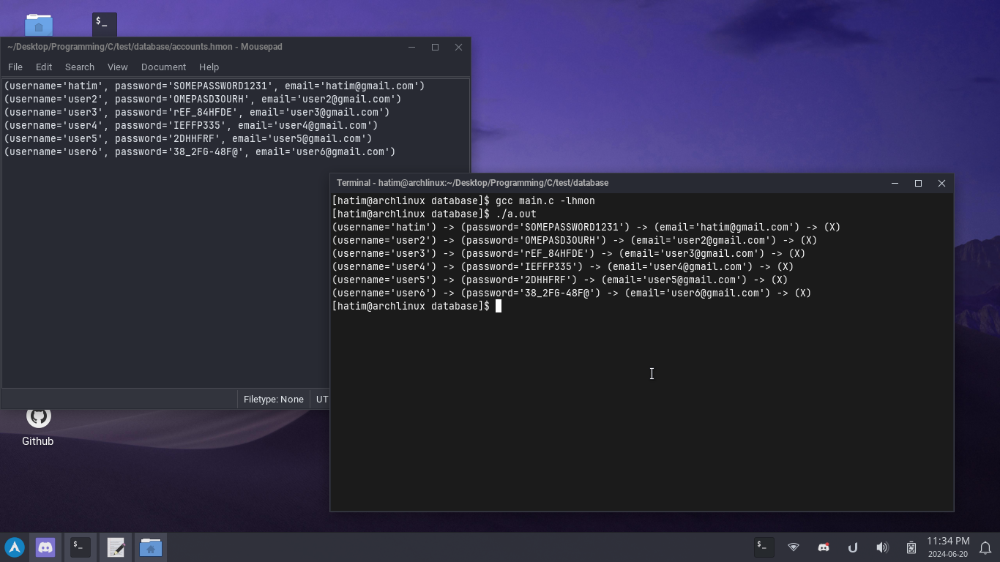

# Hatim's Minimal Object Notation
A minimal object notation library in C!

# Overview
This is a minimal object notation, mainly used for my personal projects, so keep your expectations low

# Basic usage
The syntax of an object looks like this:
```
(username = 'John Doe', password = 'SOMEPASS123', age = 18, isBanned = false)
```

# The C Api
Example of usage (this includes almost every function you need):

```c
#include <hmon.h>

int main(void) {
  // Creating an object
  HMON_Object *object = NULL;

  // Adding object properties
  hmon_object_add_string(&object, "firstName", "John");
  hmon_object_add_string(&object, "lastName", "Doe");
  hmon_object_add_int(&object, "age", 32);
  hmon_object_add_boolean(&object, "likesCoffee", true);

  // Deleting a key
  hmon_object_delete_key(&object, "lastName");

  // Printing an object
  hmon_object_print(&object);

  // Length of an object (how many key-value pairs it has)
  size_t length = hmon_object_length(&object);
  printf("Object has %zu key-value pairs\n", length);

  if (hmon_object_has_key(&object, "age")) {
    printf("Object has 'age' key\n");
  }

  // Format object into a heap allocated string
  char *format = hmon_object_format(&object);
  if (format != NULL) {
    printf("Format: %s\n", format);
    free((void*)format);
  }

  // Destroying object
  hmon_object_destroy(&object);

  // Much more in the example directory!
  return 0;
}
```

Output:
```
(firstName='John') -> (age=31) -> (likesCoffee=true) -> (X)
Object has 3 key-value pairs
Object has 'age' key
Format: (firstName='John', age=31, likesCoffee=true)
```
More examples in **examples/**

# Example of usage
These are the type of *personal projects* I was talking about



# Does this support arrays and nesting ?
No

# License
MIT License.
