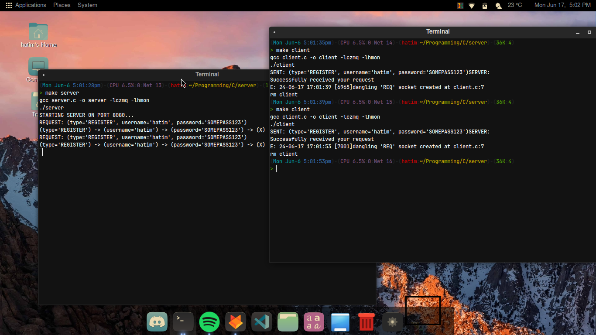

# Hatim's Minimal Object Notation
A minimal object notation library in C!

# Overview
This is a minimal object notation, mainly used for my personal projects, so keep your expectations low

# Basic usage
The syntax of an object looks like this:
```
(username = 'John Doe', password = 'SOMEPASS123', age = 18, isBanned = false)
```

# The C Api
Example of usage (this includes almost every function you need):

```c
#include <hmon.h>

int main(void) {
	// ----------------------------
	// Format HMON object into a string
	// ----------------------------
	
	// Create new object
	HMON_Object *object = NULL;

	// Add object properties
	hmon_object_add_string(&object, "name", "hatim");
	hmon_object_add_string(&object, "email", "hatim@gmail.com");
	hmon_object_add_int(&object, "age", 18);
	hmon_object_add_boolean(&object, "isStudent", true);

	// Remove a key-value pair
	hmon_object_delete_key(&object, "email");

	// Print object
	hmon_object_print(&object);

	// Reverse object
	hmon_object_reverse(&object);
	hmon_object_print(&object);

	/* Soon */
	// // Update key-value pairs
	// hmon_object_update_int(&object, "age", 19);
	// hmon_object_update_text(&object, "name", "john doe");
	// hmon_object_print(&object);

	// Get length of an object
	size_t len = hmon_object_length(&object);
	printf("Object has %zu key-value pairs\n", len);

	// Format object to string
	char *formatted_string = hmon_object_format(&object);
	
	if (formatted_string != NULL) {
		printf("Formatted string: %s\n", formatted_string);
		free((void*)formatted_string);
	}

	// Destroy object
	hmon_object_destroy(&object);

	// ----------------------------
	// Parse string into HMON Object
	// ----------------------------
	
	HMON_Object *account_info = NULL;
	
	hmon_parse_string_object(&account_info, "(username = 'hatim', password = 'SOMEPASS123', email = 'hatim@gmail.com', age = 18, isBanned = false)");

	hmon_object_print(&account_info);

	/* Soon */
	// // Get specific key from object
	// char *username = hmon_object_get_text(&account_info, "username");
	// char *password = hmon_object_get_text(&account_info, "password");
	// int age = hmon_object_get_int(&account_info, "age");

	// if (username != NULL && password != NULL) {
	// 	printf("Got account with username %s and password %s, age is %d\n", username, password, age);
	// 	free((void*)username);
	// 	free((void*)password);
	// }	

	hmon_object_destroy(&account_info);
	return 0;
}
```

Output:
```
(name='hatim') -> (age=18) -> (isStudent=true) -> (X)
(isStudent=true) -> (age=18) -> (name='hatim') -> (X)
(isStudent=true) -> (age=19) -> (name='john doe') -> (X)
Object has 3 key-value pairs
Formatted string: (isStudent=true, age=19, name='john doe')
(username='hatim') -> (password='SOMEPASS123') -> (email='hatim@gmail.com') -> (age=18) -> (isBanned=false) -> (X)
Got account with username hatim and password SOMEPASS123, age is 18
```
Read **src/hmon.h** for more information

# Example of usage
Mostly used for server-client architecture (REQUEST-RESPONSE server):


# Does this support arrays and nesting ?
No

# License
MIT License.
